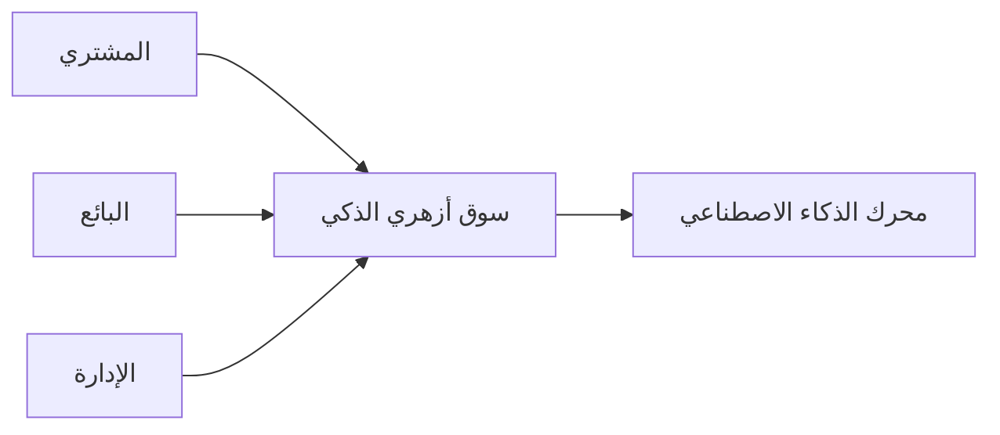
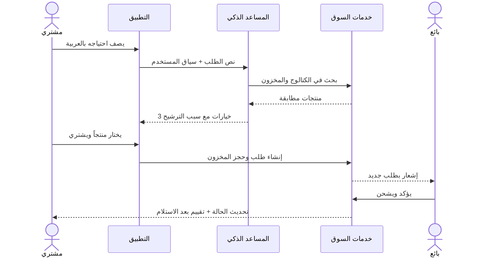
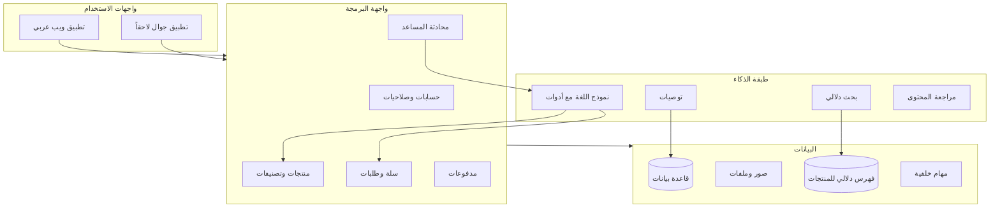

# خطة برنامج سوق أزهري الذكي

وثيقة المرجع الأولى للمشروع. الهدف منها أن توضح **ماذا نبني، لمن، وكيف** قبل كتابة الكود.

---

## 1. الفكرة باختصار

**سوق أزهري الذكي** منصة تجارة إلكترونية عربية تعتمد على الذكاء الاصطناعي لمساعدة المشتري على إيجاد المنتج المناسب، ومساعدة البائع على إدارة متجره بذكاء.

ليست مجرد متجر يعرض سلعاً. البرنامج يعمل كوسيط ذكي بين ثلاثة أطراف:

| الطرف | ماذا يريد | ماذا يقدم له البرنامج |
| --- | --- | --- |
| المشتري | شراء سريع وآمن | بحث ذكي، توصيات، مساعد محادثة، تتبع الطلب |
| البائع | بيع أكثر بجهد أقل | لوحة متجر، تسعير مقترح، تحليلات، ردود آلية |
| الإدارة | سوق منظم وموثوق | مراجعة المنتجات، مكافحة الغش، تقارير المنصة |

---

## 2. المشكلة التي يحلها المشروع

الأسواق الإلكترونية التقليدية تضع عبء الاختيار كله على المستخدم:

- البحث بالكلمات الدقيقة فقط، فيفشل إن كتب المشتري وصفاً عاماً.
- لا يوجد من يسأل المشتري: «لمن تشتري؟ وبأي ميزانية؟»
- البائع الجديد لا يعرف كيف يكتب وصفاً جيداً أو سعراً مناسباً.
- الدعم بطيء، والشكاوى تتراكم يدوياً.

سوق أزهري الذكي يعالج ذلك بمساعد ذكي في كل خطوة: البحث، المقارنة، الشراء، والمتابعة بعد البيع.

---

## 3. الرؤية والنتيجة المطلوبة

> سوق عربي يفهم لغة المشتري، يرشّح له ما يناسبه، ويمكّن البائع من البيع دون خبرة تقنية.

مؤشرات النجاح الأولى (بعد الإطلاق التجريبي):

- المشتري يجد منتجاً مناسباً خلال أقل من دقيقة عبر البحث أو المحادثة.
- نسبة إكمال الطلب من سلة التسوق لا تقل عن مستوى السوق المعتاد.
- البائع يستطيع نشر أول منتج له في أقل من 5 دقائق بمساعدة الذكاء الاصطناعي.
- كل عملية بيع تمر عبر حالة طلب واضحة: جديد → مؤكد → مشحون → مكتمل.

---

## 4. من يستخدم البرنامج

### المشتري

- يتصفح ويتسوق دون حساب للتصفح فقط.
- يسجّل عند إضافة منتج للسلة أو عند الشراء.
- يسأل المساعد الذكي بالعربية العامية أو الفصحى.
- يتابع طلباته، التقييمات، والإرجاع.

### البائع

- ينشئ متجراً ويضيف منتجات (يدوياً أو بمساعدة الذكاء الاصطناعي).
- يستلم الطلبات ويحدّث حالة الشحن.
- يرى تقارير المبيعات والمنتجات الراكدة.

### الإدارة

- توافق على المتاجر والمنتجات المخالفة للسياسة.
- تدير التصنيفات، العمولات، والشكاوى.
- تراقب جودة إجابات المساعد الذكي.

---

## 5. ماذا يفعل البرنامج (القدرات الأساسية)

### أ. واجهة السوق

- الصفحة الرئيسية: تصنيفات، عروض، منتجات مميزة، وترشيحات حسب السلوك.
- صفحة المنتج: صور، وصف، مواصفات، تقييمات، أسئلة، ومنتجات مشابهة.
- السلة والدفع: عنوان، طريقة دفع، ملخص التكلفة، تأكيد الطلب.
- حساب المستخدم: الطلبات، المفضلة، العناوين، المحفظة لاحقاً.

### ب. المساعد الذكي للمشتري

المساعد ليس دردشة عامة. له مهام محددة:

1. فهم طلب الشراء بالعربية («أبي لابتوب للدراسة تحت 2000»).
2. استخراج القيود: الفئة، الميزانية، الاستخدام، اللون، المقاس.
3. البحث داخل كتالوج السوق فقط (لا يخترع منتجات غير موجودة).
4. مقارنة خيارين أو ثلاثة بوضوح.
5. إضافة المنتج للسلة بعد موافقة المستخدم.
6. الإجابة عن حالة الطلب والشحن من بيانات النظام الحقيقية.

قاعدة ذهبية: **المساعد لا يبيع ما ليس في المخزون، ولا يؤكد سعراً غير السعر المعروض.**

### ج. أدوات الذكاء الاصطناعي للبائع

- توليد عنوان ووصف ومواصفات من صورة أو نقاط قصيرة.
- اقتراح تصنيف ووسوم.
- اقتراح سعر مبدئي حسب منتجات مشابهة في السوق.
- ردود مقترحة على أسئلة المشترين (يراجعها البائع قبل الإرسال).

### د. تشغيل السوق

- تسجيل دخول بالبريد أو رقم الجوال.
- صلاحيات: مشتري / بائع / مشرف.
- مخزون، كوبونات، تقييمات، إشعارات.
- لوحة إدارة للمخالفات والعمولات.

---

## 6. رحلة المستخدم الأساسية

---

## 7. شكل النظام التقني

ثلاث طبقات واضحة، حتى يمكن بناء النسخة الأولى بسرعة ثم تطوير الذكاء لاحقاً دون إعادة كتابة السوق.

### مبدأ التصميم

السوق يعمل حتى لو تعطّل الذكاء الاصطناعي: التصفح، السلة، والطلب لا تعتمد على النموذج اللغوي. الذكاء طبقة مساعدة فوق سوق مكتمل.

---

## 8. البيانات الرئيسية

| الكيان | أهم الحقول |
| --- | --- |
| مستخدم | اسم، جوال/بريد، دور، حالة الحساب |
| متجر | اسم، وصف، مالك، حالة التفعيل |
| منتج | عنوان، وصف، سعر، مخزون، تصنيف، صور، حالة النشر |
| تصنيف | اسم عربي، أب، ترتيب العرض |
| سلة | مستخدم، عناصر، كوبون |
| طلب | رقم، عنوان شحن، حالة، إجمالي، عمولة |
| عنصر طلب | منتج، كمية، سعر لحظة الشراء |
| تقييم | نجوم، تعليق، طلب مرتبط |
| محادثة مساعد | رسائل، نية مكتشفة، منتجات مقترحة |
| دفعة | بوابة الدفع، مبلغ، حالة |

قاعدة مهمة للمنتجات: السعر والكمية المحفوظة في الطلب **لا تتغير** إذا عدّل البائع السعر لاحقاً.

---

## 9. التقنية المقترحة للنسخة الأولى

اختيار عملي يسرّع الإطلاق ويبقي الباب مفتوحاً للتطبيق الجوال:

| الطبقة | الاختيار | السبب |
| --- | --- | --- |
| الواجهة | Next.js + TypeScript | موقع سريع، عربي واتجاه RTL، وقابل لتحويله لتطبيق لاحقاً |
| الواجهة البرمجية | نفس مشروع Next.js في البداية | فريق صغير، نشر واحد، ثم فصل الخدمة عند الحاجة |
| قاعدة البيانات | PostgreSQL | طلبات، مخزون، وعلاقات واضحة |
| الملفات | تخزين كائنات للصور | لا نحفظ الصور داخل قاعدة البيانات |
| البحث الذكي | فهرس دلالي فوق أوصاف المنتجات | يفهم المعنى لا الكلمات الحرفية فقط |
| المساعد | نموذج لغة مع أدوات مربوطة بخدمات السوق | يبحث ويضيف للسلة من بيانات حقيقية |
| المدفوعات | بوابة محلية + بطاقة عند التوفر | يبدأ بالدفع عند الاستلام إن لزم |

اللغة الافتراضية للواجهة: **العربية** مع دعم RTL من اليوم الأول.

---

## 10. ما يدخل في كل مرحلة

لا نبني كل شيء دفعة واحدة. كل مرحلة تنتج برنامجاً يمكن تجربته.

### المرحلة 0 — الأساس

- هيكل المشروع، الهوية البصرية، والتسجيل.
- تصنيفات، منتجات تجريبية، وصفحات العرض.
- سلة وطلب بحالة يدوية (بدون بوابة دفع إن تعذر).

نتيجة المرحلة: زائر يستطيع تصفح السوق وإتمام طلب تجريبي.

### المرحلة 1 — سوق يعمل

- حساب بائع ولوحة إضافة منتج.
- مخزون حقيقي يمنع البيع فوق الكمية.
- تتبع حالة الطلب للبائع والمشتري.
- لوحة إدارة بسيطة.

نتيجة المرحلة: بائع ومشتري يكملان دورة بيع كاملة.

### المرحلة 2 — الذكاء يظهر للمستخدم

- بحث يفهم الجملة العربية لا الكلمة المطابقة فقط.
- مساعد محادثة يرشّح من الكتالوج ويقارن.
- توصيات في الصفحة الرئيسية وصفحة المنتج.
- توليد وصف المنتج للبائع.

نتيجة المرحلة: المستخدم يشعر أن السوق «يفهمه».

### المرحلة 3 — الثقة والنمو

- دفع إلكتروني، كوبونات، تقييمات موثوقة.
- إشعارات، شكاوى، وإرجاع.
- مكافحة الإعلانات المضللة بمراجعة محتوى.
- تقارير للبائع والإدارة.

نتيجة المرحلة: المنصة جاهزة لتوسع عدد البائعين.

---

## 11. شاشات النسخة الأولى

1. الرئيسية
2. التصنيف / نتائج البحث
3. تفاصيل المنتج
4. السلة
5. إتمام الطلب
6. طلباتي
7. محادثة المساعد الذكي
8. لوحة البائع: المنتجات والطلبات
9. لوحة الإدارة: المستخدمون والمنتجات المخالفة

أي شاشة خارج هذه القائمة تُؤجَّل بعد اكتمال دورة البيع.

---

## 12. سياسات يجب حسمها مبكراً

هذه قرارات منتج، لا تفاصيل برمجة، وتؤثر على التصميم:

1. **نموذج العمولة:** نسبة من كل طلب، أم اشتراك شهري للبائع، أم الاثنان؟
2. **من يشحن؟** البائع مباشرة، أم شركة شحن موحدة لاحقاً؟
3. **الدفع عند الإطلاق:** عند الاستلام فقط، أم إلكتروني من اليوم الأول؟
4. **حدود المساعد:** هل يسمح بالشراء داخل المحادثة أم يرشّح فقط؟
5. **سياسة الإرجاع:** عدد الأيام، ومن يتحمل تكلفة الشحن؟
6. **المحتوى الممنوع:** قائمة واضحة قبل فتح التسجيل للبائعين.

حتى تُحسم هذه النقاط، التنفيذ يفترض مؤقتاً:

- عمولة نسبة من الطلب.
- الشحن مسؤولية البائع.
- الدفع عند الاستلام في المرحلة 0 و1.
- المساعد يرشّح ويضيف للسلة، والدفع يبقى في شاشة الطلب.
- إرجاع خلال 7 أيام للمنتجات غير المستخدمة.

---

## 13. المخاطر وكيف نتعامل معها

| الخطر | الأثر | المعالجة |
| --- | --- | --- |
| المساعد يخترع منتجاً أو سعراً | فقدان ثقة | ربط الإجابة بأدوات الكتالوج فقط، ورفض الإجابة إن لم توجد بيانات |
| بيع أكثر من المخزون | شكاوى | حجز الكمية عند إنشاء الطلب |
| صور أو أوصاف مخالفة | ضرر للعلامة | مراجعة يدوية في البداية + فلتر محتوى لاحقاً |
| تعقيد تقني مبكر | تأخير الإطلاق | سوق يعمل بدون ذكاء أولاً |
| ضعف البيانات في البداية | توصيات سيئة | منتجات تجريبية جيدة + قواعد بسيطة قبل التعلم الآلي الثقيل |

---

## 14. كيف نعرف أن الخطة نجحت

قبل كتابة سطر إنتاج، المشروع يكون واضحاً إذا استطعنا الإجابة بنعم على:

- [ ] نعرف من المستخدم الأول: مشتري يبحث، أم بائع يريد متجراً؟
- [ ] نعرف دورة البيع الدنيا: منتج → سلة → طلب → تأكيد.
- [ ] نعرف أين يظهر الذكاء: بحث + محادثة + وصف المنتج.
- [ ] نعرف ما لن نبنيه الآن: تطبيق جوال، محفظة، وإعلانات ممولة.

هذه الوثيقة هي الإجابة المعتمدة حتى تُحدَّث بقرار صريح.

---

## 15. الخطوة التالية بعد اعتماد الخطة

1. تثبيت قرارات القسم 12.
2. بناء هيكل المشروع حسب المرحلة 0.
3. إدخال كتالوج تجريبي عربي (تصنيفات ومنتجات وهمية واقعية).
4. إطلاق نسخة داخلية للتجربة قبل أي ذكاء اصطناعي متقدم.
